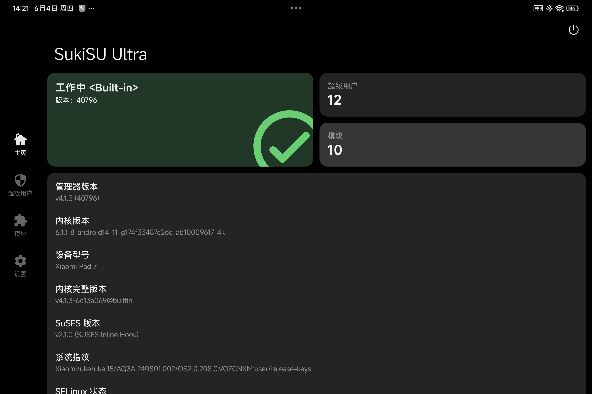
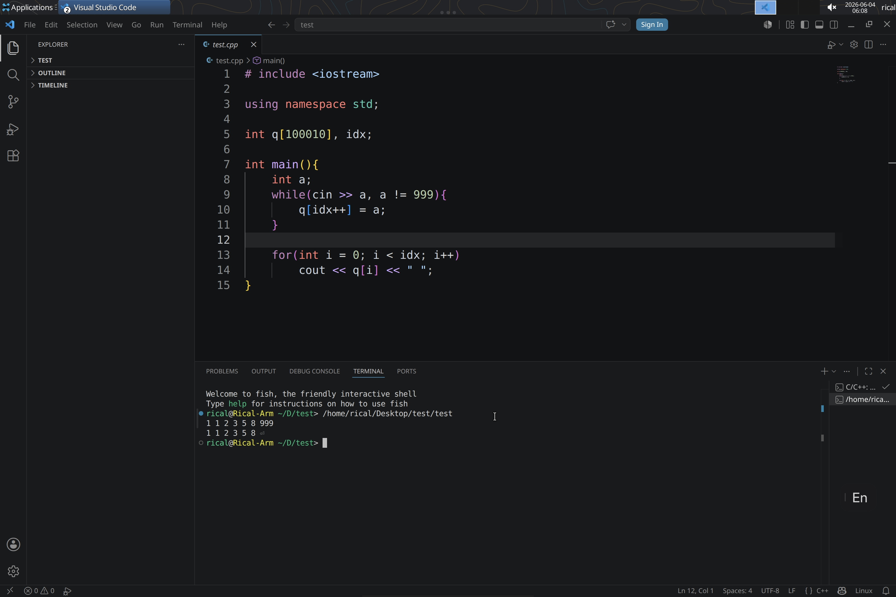
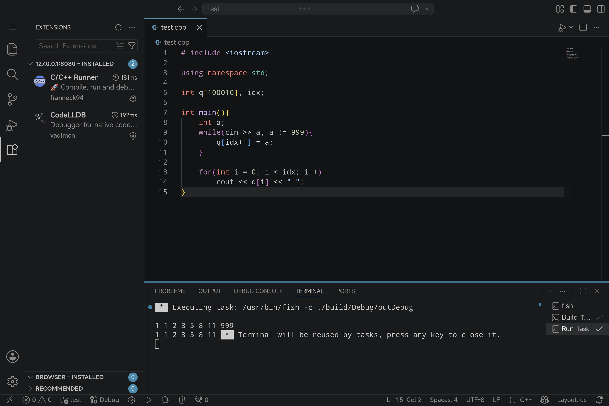
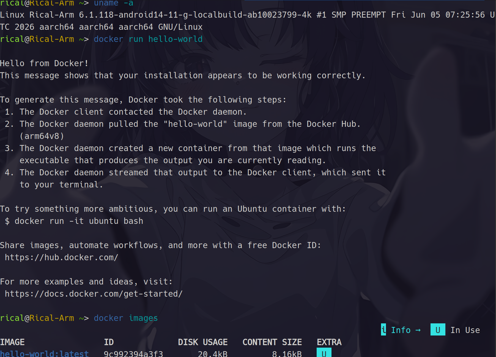
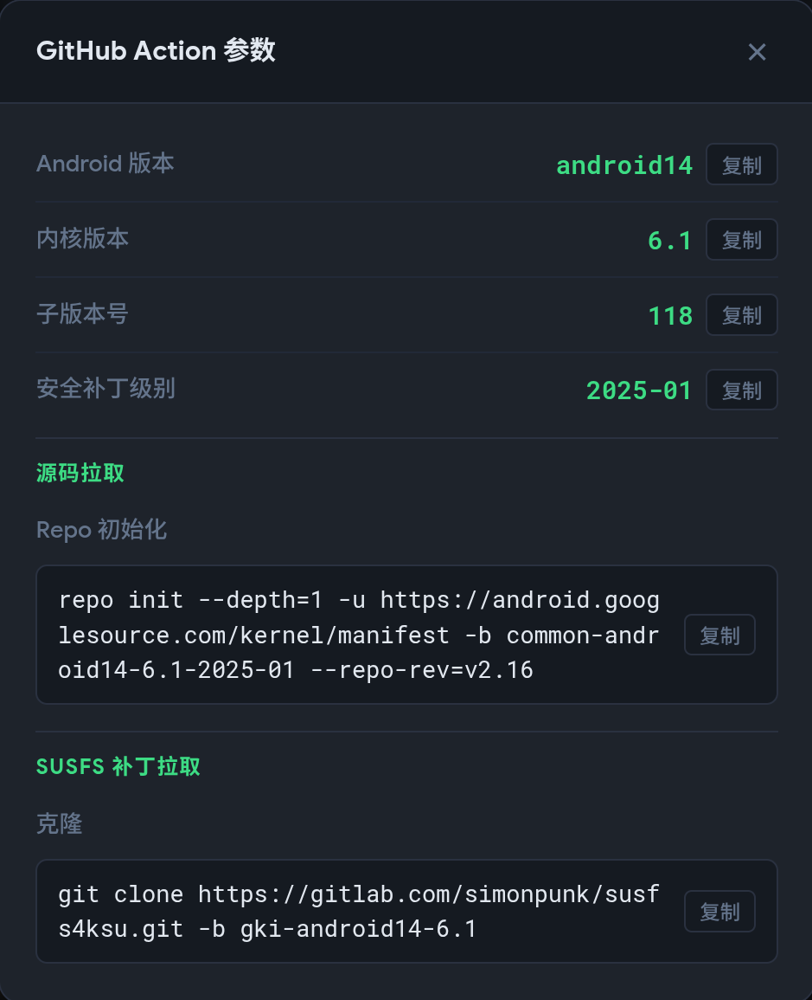
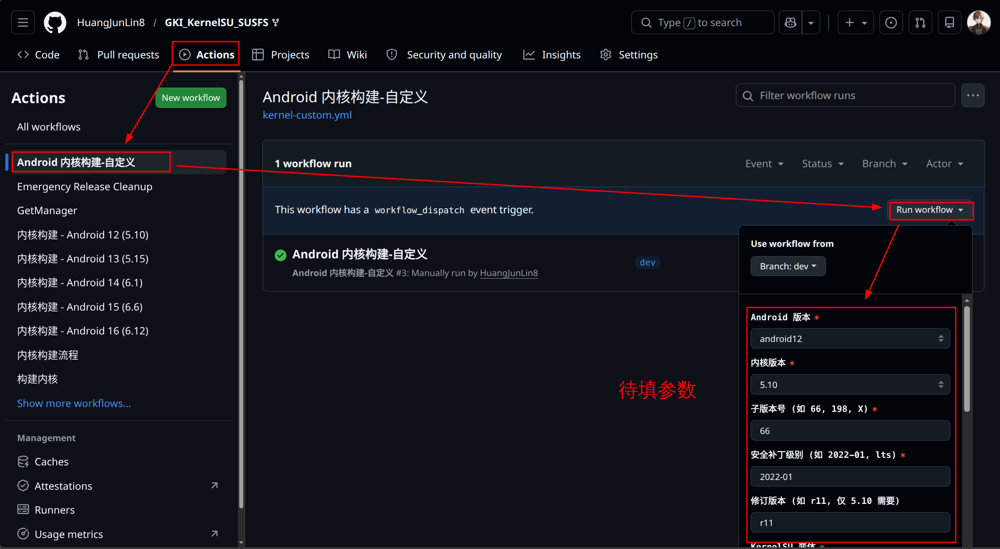
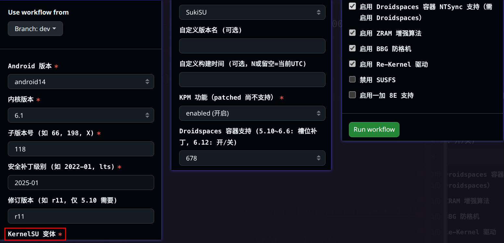
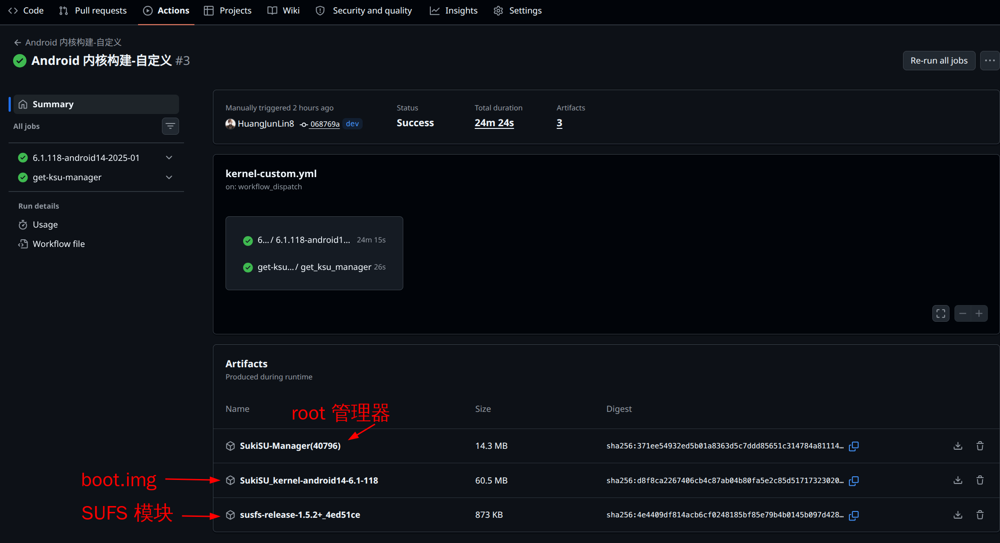

本文档记录了我给 `XiaoMi Pad 7` + `HyperOS 2.0.208` + `6.1.118` 官方内核
重新编译一个 `GKI` 版本的内核的经历，以及一些测试和踩坑情况

主要使用的是 `folk` 自 [zzh20188/GKI_KernelSU_SUSFS](https://github.com/zzh20188/GKI_KernelSU_SUSFS) 的 `Github Action` 内核编译项目

编译出的内核支持下面的功能：

```
1. Droidspaces 容器支持
2. 启用 Droidspaces 容器 NTSync 支持
3. 启用 ZRAM 增强算法
4. 启用 BBG 防格机
5. 启用 Re-Kernel 驱动
6. 启用 SUSFS 
```

其他版本内核或只须特定功能的朋友请参考[GKI_KernelSU_SUSFS](https://github.com/zzh20188/GKI_KernelSU_SUSFS) 的教程自行编译：[自定义编译指南](https://zzh20188.github.io/GKI_KernelSU_SUSFS/guide.html)

也可结合我的真实经历一起食用：[操作记录](#操作记录)

我编译好的内核（亲测可用）：[Release](https://github.com/HuangJunLin8/uke_GKI_KernelSU_SUSFS/releases/tag/release)


---

# 结果展示

## 1. SukiSU 主页



## 2. xfce 桌面

在 `Droidspaces` 里装了 Ubuntu 24 的镜像

在 Termux-x11中显示：`3D` 测试程序可以运行，`firefox` 网页可以打开


## 3. VScode 

在 Termux-x11中显示：VScode  



## 4. code-server

在浏览器全屏打开：`code-server` （鼠标指针太大了）



## 5. docker

额外编译了一版内核，开了 `CONFIG_USER_NS` ，容器内可以正常运行 `docker` 了，下载见 [release-dev](https://github.com/HuangJunLin8/uke_GKI_KernelSU_SUSFS/releases/tag/dev)

但`Droidspaces` 的检查输出会提示建议关闭该选项

`User Namespace` 可让一个进程在自己创建的小世界里拥有 `root` 身份，而不是真正获得系统 `root`

但普通 `App` 可以因此调用更多的内核功能，所以要防止恶意 `App` 找出漏洞提权





## 6. chroot 和 DroidSpaces 对比

使用 `DroidSpaces` 创建的 `Linux` 优势是进程隔离，**有 `systemd`**

但`GPU` 并非直通，是以镜像到隔离 `/dev` 的方式，会有损耗，**显示桌面会有卡顿**

而使用 `chroot` 方式的 `Linux` 是 `GPU` 直通的，**桌面的显示会流畅很多**

另外给你看看 GPU 跑分对比：（详细信息可见：[Linux GPU 测试](#Linux-GPU-测试) ）

| 环境                     | GPU 驱动 | glmark2 Score | 解析                            |
| ------------------------ | -------- | ------------- | ------------------------------- |
| Ubuntu 24 in DroidSpaces | Zink     | 146           | 容器 + Zink 性能低，3D 加速有限 |
| Ubuntu 24 in Chroot      | Zink     | 264           | 原生环境提升，Zink 性能改善明显 |
| Ubuntu 24 in Chroot      | KGSL     | 805           | 原生环境 + 原生驱动，性能最佳   |
---


# 操作记录

 编译适合自己系统的 GKI 内核，大体上就这几个步骤：

1. 依照教程 [自定义编译指南](https://zzh20188.github.io/GKI_KernelSU_SUSFS/guide.html) 填入参数，启动 `Github Action` 来编译内核
2. 把手机内核的 `ramdisk.cpio` 打包加入编译的内核中
3. 刷入到 `boot_a.img` 然后 enjoy

---

## 1. 参数获取

设置里查到内核版本：`6.1.118`，在 [版本查询页面](https://zzh20188.github.io/GKI_KernelSU_SUSFS/) 进一步获取完整信息



> 手机安卓版本 `Android 15` 不是我们需要的，得是内核版本号里的 `android14` 

---

## 2. 配置 Github Action

fork 仓库：[GKI_KernelSU_SUSFS](https://github.com/zzh20188/GKI_KernelSU_SUSFS) 后，在 `Actions` 打开配置界面



进行如下配置，然后启动工作流

```
Android 版本  : android14
内核版本      : 6.1
子版本号      : 118
补丁级别      : 2025-01
KSU 变体      : SukiSU
构建时间      : 
SUSFS 状态    : true
ZRAM 增强     : true
BBG 补丁      : true
KPM 功能      : enabled
Re-Kernel     : true
Droidspaces   : 678
NTSync        : true
```



**注意：KernelSU 变体 有些选项会编译失败，见 [参数测试](#参数测试)**

---

## 3. 下载编译成果

都是压缩包的形式，需要先解压



---

## 4. 镜像重打包

输出的内核镜像 ` android14-6.1.118-2025-01-boot.img ` 需要重新打包

把原厂的 `ramdisk.cpio` 加进来

### a. 工程目录

```
.
├── boot
│   ├── boot_a.img                   # 小米 pad 7 提取出来的官方 boot.img
│   │
│   ├── repack	                     # 解包官方boot, 重打包为 new-boot.img
│   │   ├── kernel
│   │   └── ramdisk.cpio
│   │
│   └── unpack-40796				 # 解包输出的.img
│       ├── kernel
│       └─── android14-6.1.118-2025-01-boot.img
│
└── magiskboot                       # 镜像处理工具
```

---

### b. 获取 magiskboot 

`magiskboot` 是镜像处理工具，可解压、重打包 `.img` 文件

从 [Magisk Release](https://github.com/topjohnwu/Magisk/releases) 下载最新的 apk，然后**以压缩包的方式打开 apk**

进入目录 `lib/x86_64` 获取  `libmagiskboot.so`

重命名为 `magiskboot` 即可，用 `./magiskboot` 来运行

---

### c. 解包原厂boot

```
./magiskboot unpack boot_a.img
```

能得到 `kernel`（删除） 以及 **`ramdisk.cpio` （移动到 `boot/repack` 里面）**

---

### d. 解包编译输出

```
./magiskboot unpack android14-6.1.118-2025-01-boot.img 
```

能得到 `kernel`，**将其移动到 `boot/repack` 里面**

---

### e. 打包为新 boot.img

在目录 `boot/repack` 下执行：

```
./magiskboot repack boot_a.img new-boot.img
```

依据旧的 `boot_a.img` 头部信息 + `repack` 目录下内容进行打包，输出 `new-boot.img`


## 5. 镜像烧录

重启到 `fastboot` 后， 在目录 `boot/repack` 下执行：

```
fastboot flash boot_a new-boot.img
```

```
fastboot reboot
```

---

# 参数测试

`Kernel SU` 变体有如下选择：

```
Official
SukiSU
SukiSU(40726)
SukiSU(40548)
ReSukiSU
```

结果：

### **SukiSU：成功启动**

选这个选项会拉取最新 `sukisu` 代码来生成配套的 `apk`，我编译时的版本是 `40796`

### **ReSukiSU：失败**

状况：内核编译失败

可能是版本不匹配

```
ReSukiSU --> 2026-05-30
SUSFS    --> 2026-06-02
```

### **SukiSU (40726)：失败**

状况：管理器 `SukiSU(40726) ` 该版本在 `XiaomiPad7` 上闪退

---

# Linux GPU 测试

## 测试环境

1. 统一在应用 `termux-x11` 上显示
2. 系统都是 `ubuntu 24.04.04`
3. 都清掉多余后台
4. 不开启 `xfce` 桌面
5. 直接进行 `glmark2` 测试


## 测试详情

`DroidSpaces` 的 `ubuntu` 里启用不了 `ksgl` 的方式，故没测这个方案

### a. `DroidSpaces`+ `zink`

```
glmark2 2023.01
OpenGL Information
GL_VENDOR:      Mesa
GL_RENDERER:    zink Vulkan 1.4(Turnip Adreno (TM) 735 (MESA_TURNIP))
GL_VERSION:     4.6 (Compatibility Profile) Mesa 26.2.0-devel (git-3743cc80a8)
Surface Config: buf=32 r=8 g=8 b=8 a=8 depth=24 stencil=0 samples=0
Surface Size:   800x600 windowed
=======================================================
[build] use-vbo=false: FPS: 172 FrameTime: 5.842 ms
[build] use-vbo=true: FPS: 198 FrameTime: 5.063 ms
[texture] texture-filter=nearest: FPS: 173 FrameTime: 5.786 ms
[texture] texture-filter=linear: FPS: 178 FrameTime: 5.645 ms
[texture] texture-filter=mipmap: FPS: 176 FrameTime: 5.712 ms
[shading] shading=gouraud: FPS: 175 FrameTime: 5.733 ms
[shading] shading=blinn-phong-inf: FPS: 163 FrameTime: 6.165 ms
[shading] shading=phong: FPS: 171 FrameTime: 5.874 ms
[shading] shading=cel: FPS: 170 FrameTime: 5.903 ms
[bump] bump-render=high-poly: FPS: 164 FrameTime: 6.102 ms
[bump] bump-render=normals: FPS: 168 FrameTime: 5.953 ms
[bump] bump-render=height: FPS: 168 FrameTime: 5.976 ms
[effect2d] kernel=0,1,0;1,-4,1;0,1,0;: FPS: 163 FrameTime: 6.144 ms
[effect2d] kernel=1,1,1,1,1;1,1,1,1,1;1,1,1,1,1;: FPS: 156 FrameTime: 6.427 ms
[pulsar] light=false:quads=5:texture=false: FPS: 162 FrameTime: 6.187 ms
[desktop] blur-radius=5:effect=blur:passes=1:separable=true:windows=4: FPS: 138 FrameTime: 7.247 ms
[desktop] effect=shadow:windows=4: FPS: 159 FrameTime: 6.297 ms
[buffer] columns=200:interleave=false:update-dispersion=0.9:update-fraction=0.5:update-method=map: FPS: 79 FrameTime: 12.715 ms
[buffer] columns=200:interleave=false:update-dispersion=0.9:update-fraction=0.5:update-method=subdata: FPS: 91 FrameTime: 11.059 ms
[buffer] columns=200:interleave=true:update-dispersion=0.9:update-fraction=0.5:update-method=map: FPS: 84 FrameTime: 11.949 ms
[ideas] speed=duration: FPS: 76 FrameTime: 13.194 ms
[jellyfish] <default>: FPS: 175 FrameTime: 5.727 ms
[terrain] <default>: FPS: 56 FrameTime: 18.096 ms
[shadow] <default>: FPS: 169 FrameTime: 5.944 ms
[refract] <default>: FPS: 86 FrameTime: 11.649 ms
[conditionals] fragment-steps=0:vertex-steps=0: FPS: 164 FrameTime: 6.120 ms
[conditionals] fragment-steps=5:vertex-steps=0: FPS: 147 FrameTime: 6.836 ms
[conditionals] fragment-steps=0:vertex-steps=5: FPS: 150 FrameTime: 6.711 ms
[function] fragment-complexity=low:fragment-steps=5: FPS: 143 FrameTime: 7.030 ms
[function] fragment-complexity=medium:fragment-steps=5: FPS: 147 FrameTime: 6.840 ms
[loop] fragment-loop=false:fragment-steps=5:vertex-steps=5: FPS: 144 FrameTime: 6.963 ms
[loop] fragment-steps=5:fragment-uniform=false:vertex-steps=5: FPS: 146 FrameTime: 6.861 ms

[loop] fragment-steps=5:fragment-uniform=true:vertex-steps=5: FPS: 145 FrameTime: 6.918 ms

=======================================================
                                  glmark2 Score: 146 
=======================================================
```

### b. `Chroot` + `zink`

```
=======================================================
    glmark2 2023.01
=======================================================
    OpenGL Information
    GL_VENDOR:      Mesa
    GL_RENDERER:    zink Vulkan 1.4(Turnip Adreno (TM) 735 (MESA_TURNIP))
    GL_VERSION:     4.6 (Compatibility Profile) Mesa 26.2.0-devel (git-3743cc80a8)
    Surface Config: buf=32 r=8 g=8 b=8 a=8 depth=24 stencil=0 samples=0
    Surface Size:   800x600 windowed
=======================================================
[build] use-vbo=false: FPS: 311 FrameTime: 3.218 ms
[build] use-vbo=true: FPS: 290 FrameTime: 3.460 ms
[texture] texture-filter=nearest: FPS: 290 FrameTime: 3.455 ms
[texture] texture-filter=linear: FPS: 285 FrameTime: 3.512 ms
[texture] texture-filter=mipmap: FPS: 291 FrameTime: 3.439 ms
[shading] shading=gouraud: FPS: 293 FrameTime: 3.419 ms
[shading] shading=blinn-phong-inf: FPS: 294 FrameTime: 3.405 ms
[shading] shading=phong: FPS: 285 FrameTime: 3.510 ms
[shading] shading=cel: FPS: 289 FrameTime: 3.461 ms
[bump] bump-render=high-poly: FPS: 279 FrameTime: 3.592 ms
[bump] bump-render=normals: FPS: 302 FrameTime: 3.318 ms
[bump] bump-render=height: FPS: 296 FrameTime: 3.381 ms
[effect2d] kernel=0,1,0;1,-4,1;0,1,0;: FPS: 278 FrameTime: 3.600 ms
[effect2d] kernel=1,1,1,1,1;1,1,1,1,1;1,1,1,1,1;: FPS: 243 FrameTime: 4.118 ms
[pulsar] light=false:quads=5:texture=false: FPS: 293 FrameTime: 3.414 ms
[desktop] blur-radius=5:effect=blur:passes=1:separable=true:windows=4: FPS: 228 FrameTime: 4.404 ms
[desktop] effect=shadow:windows=4: FPS: 261 FrameTime: 3.838 ms
[buffer] columns=200:interleave=false:update-dispersion=0.9:update-fraction=0.5:update-method=map: FPS: 240 FrameTime: 4.171 ms
[buffer] columns=200:interleave=false:update-dispersion=0.9:update-fraction=0.5:update-method=subdata: FPS: 237 FrameTime: 4.222 ms
[buffer] columns=200:interleave=true:update-dispersion=0.9:update-fraction=0.5:update-method=map: FPS: 249 FrameTime: 4.032 ms
[ideas] speed=duration: FPS: 232 FrameTime: 4.327 ms
[jellyfish] <default>: FPS: 265 FrameTime: 3.776 ms
[terrain] <default>: FPS: 105 FrameTime: 9.584 ms
[shadow] <default>: FPS: 242 FrameTime: 4.136 ms
[refract] <default>: FPS: 152 FrameTime: 6.591 ms
[conditionals] fragment-steps=0:vertex-steps=0: FPS: 278 FrameTime: 3.600 ms
[conditionals] fragment-steps=5:vertex-steps=0: FPS: 281 FrameTime: 3.563 ms
[conditionals] fragment-steps=0:vertex-steps=5: FPS: 279 FrameTime: 3.589 ms
[function] fragment-complexity=low:fragment-steps=5: FPS: 282 FrameTime: 3.552 ms
[function] fragment-complexity=medium:fragment-steps=5: FPS: 280 FrameTime: 3.575 ms
[loop] fragment-loop=false:fragment-steps=5:vertex-steps=5: FPS: 279 FrameTime: 3.588 ms
[loop] fragment-steps=5:fragment-uniform=false:vertex-steps=5: FPS: 278 FrameTime: 3.603 ms
[loop] fragment-steps=5:fragment-uniform=true:vertex-steps=5: FPS: 271 FrameTime: 3.694 ms
=======================================================
                                  glmark2 Score: 264 
=======================================================
```

### c. `Chroot` + `ksgl`

```
(base) ➜  ~ glmark2 
MESA-LOADER: failed to retrieve device information
MESA: error: kgsl_pipe_get_param:103: invalid param id: 13
=======================================================
    glmark2 2023.01
=======================================================
    OpenGL Information
    GL_VENDOR:      freedreno
    GL_RENDERER:    FD735
    GL_VERSION:     4.6 (Compatibility Profile) Mesa 26.2.0-devel (git-3743cc80a8)
    Surface Config: buf=32 r=8 g=8 b=8 a=8 depth=24 stencil=0 samples=0
    Surface Size:   800x600 windowed
=======================================================
[build] use-vbo=false: FPS: 1003 FrameTime: 0.997 ms
[build] use-vbo=true: FPS: 846 FrameTime: 1.183 ms
[texture] texture-filter=nearest: FPS: 990 FrameTime: 1.011 ms
[texture] texture-filter=linear: FPS: 943 FrameTime: 1.061 ms
[texture] texture-filter=mipmap: FPS: 862 FrameTime: 1.161 ms
[shading] shading=gouraud: FPS: 914 FrameTime: 1.094 ms
[shading] shading=blinn-phong-inf: FPS: 876 FrameTime: 1.142 ms
[shading] shading=phong: FPS: 842 FrameTime: 1.189 ms
[shading] shading=cel: FPS: 836 FrameTime: 1.197 ms
[bump] bump-render=high-poly: FPS: 744 FrameTime: 1.344 ms
[bump] bump-render=normals: FPS: 863 FrameTime: 1.159 ms
[bump] bump-render=height: FPS: 842 FrameTime: 1.188 ms
[effect2d] kernel=0,1,0;1,-4,1;0,1,0;: FPS: 811 FrameTime: 1.233 ms
[effect2d] kernel=1,1,1,1,1;1,1,1,1,1;1,1,1,1,1;: FPS: 622 FrameTime: 1.609 ms
[pulsar] light=false:quads=5:texture=false: FPS: 860 FrameTime: 1.163 ms
[desktop] blur-radius=5:effect=blur:passes=1:separable=true:windows=4: FPS: 630 FrameTime: 1.588 ms
[desktop] effect=shadow:windows=4: FPS: 799 FrameTime: 1.252 ms
[buffer] columns=200:interleave=false:update-dispersion=0.9:update-fraction=0.5:update-method=map: FPS: 389 FrameTime: 2.577 ms
[buffer] columns=200:interleave=false:update-dispersion=0.9:update-fraction=0.5:update-method=subdata: FPS: 315 FrameTime: 3.178 ms
[buffer] columns=200:interleave=true:update-dispersion=0.9:update-fraction=0.5:update-method=map: FPS: 440 FrameTime: 2.277 ms
[ideas] speed=duration: FPS: 539 FrameTime: 1.856 ms
[jellyfish] <default>: FPS: 792 FrameTime: 1.263 ms
[terrain] <default>: FPS: 433 FrameTime: 2.315 ms
[shadow] <default>: FPS: 757 FrameTime: 1.322 ms
[refract] <default>: FPS: 564 FrameTime: 1.776 ms
[conditionals] fragment-steps=0:vertex-steps=0: FPS: 1009 FrameTime: 0.992 ms
[conditionals] fragment-steps=5:vertex-steps=0: FPS: 1009 FrameTime: 0.992 ms
[conditionals] fragment-steps=0:vertex-steps=5: FPS: 1010 FrameTime: 0.990 ms
[function] fragment-complexity=low:fragment-steps=5: FPS: 1022 FrameTime: 0.979 ms
[function] fragment-complexity=medium:fragment-steps=5: FPS: 1030 FrameTime: 0.971 ms
[loop] fragment-loop=false:fragment-steps=5:vertex-steps=5: FPS: 1007 FrameTime: 0.994 ms
[loop] fragment-steps=5:fragment-uniform=false:vertex-steps=5: FPS: 1031 FrameTime: 0.970 ms
[loop] fragment-steps=5:fragment-uniform=true:vertex-steps=5: FPS: 997 FrameTime: 1.004 ms
=======================================================
                                  glmark2 Score: 805 
=======================================================

```

